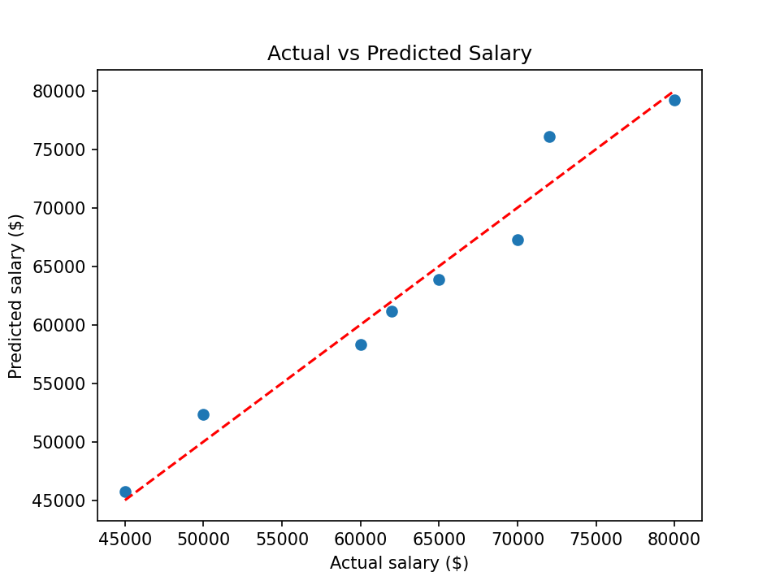

# Hiring Salary Prediction (Multiple Linear Regression)

A machine learning model that helps an HR department decide salaries for future candidates, based on **years of experience**, **written test score** and **interview score**.

## Problem Statement
Using `hiring.csv`, build a multiple linear regression model and predict the salary for these candidates:

1. 2 years of experience, test score 9, interview score 6
2. 12 years of experience, test score 10, interview score 10

## Dataset
- **File:** `hiring.csv`
- **Size:** 8 rows, 4 columns

| Column | Description |
|---|---|
| `experience` | Years of experience (written as words, e.g. "five") |
| `test_score(out of 10)` | Written test score |
| `interview_score(out of 10)` | Personal interview score |
| `salary($)` | Salary (target) |

## Data Cleaning
- `experience` is written in words ("two", "five", ...), so it was converted to numbers.
- Two missing `experience` values were filled with `0` (no experience).
- One missing `test_score` was filled with the **median** (8.0).

## Approach
1. Load the data with `pandas`
2. Clean the data (words to numbers, fill missing values)
3. Select features (`experience`, test score, interview score) and target (`salary`)
4. Train a `LinearRegression` model from `scikit-learn`
5. Check coefficients and R²
6. Predict salaries for the two new candidates

## Results

**Model equation**

`salary = 17,737 + 2,813 × experience + 1,846 × test_score + 2,205 × interview_score`

| Feature | Coefficient | Meaning |
|---|---|---|
| Experience | 2,812.95 | Each extra year adds about $2,813 |
| Test score | 1,845.71 | Each extra test point adds about $1,846 |
| Interview score | 2,205.24 | Each extra interview point adds about $2,205 |
| Intercept | 17,737.26 | Base salary when all inputs are 0 |
| R² | 0.962 | Share of salary variation explained on the training data |

**Predicted salaries**

| Candidate | Experience | Test score | Interview score | Predicted salary |
|---|---|---|---|---|
| 1 | 2 years | 9 | 6 | **$53,205.97** |
| 2 | 12 years | 10 | 10 | **$92,002.18** |



## Project Structure
```
.
├── salary-prediction-multiple-linear-regression.ipynb  # main notebook (use your notebook's file name)
├── hiring.csv                       # dataset
├── actual_vs_predicted.png          # graph
└── README.md
```

## How to Run
```bash
git clone https://github.com/<daniairfan1812>/hiring-salary-prediction.git
cd hiring-salary-prediction
pip install pandas matplotlib scikit-learn jupyter
jupyter notebook hiring_salary_prediction.ipynb
```

## Limitations
- The dataset has only **8 rows**, so the model and its R² (0.962, measured on the training data) should not be over-trusted. There is no separate test set.
- Candidate 2 has 12 years of experience, but the highest experience in the data is 11 years, so that prediction is an **extrapolation**.
- Only three factors are used. Real salaries also depend on role, education, city and more.
- Missing values were filled with simple rules (0 and median), which is an assumption.

## Future Improvements
- Collect more data and use a train/test split or cross-validation
- Add features such as education, role and location
- Compare with other models (Ridge, Random Forest)

## Tech Stack
Python, pandas, scikit-learn, Matplotlib, Jupyter Notebook
